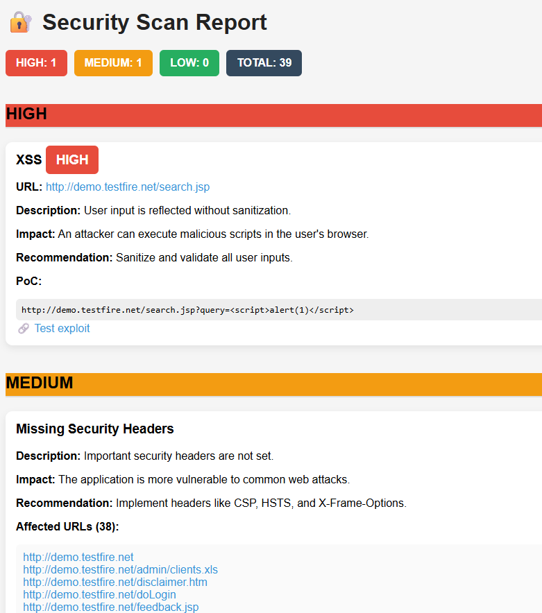

# 🔐 Web Vulnerability Scanner (Mini Burp/ZAP)

A lightweight web vulnerability scanner built in Python, designed to identify common security issues such as **XSS**, **SQL Injection**, and **missing security headers**.

This project simulates the core behavior of tools like Burp Suite or OWASP ZAP, focusing on simplicity, extensibility, and educational value.

---

## Preview



---

## Features

*  Web crawling with configurable depth
*  Detection of common vulnerabilities:

  * Cross-Site Scripting (XSS)
  * SQL Injection (SQLi)
  * Missing Security Headers
  *  Parameter extraction from URLs and forms
  *  JSON output for automation
    
  *  HTML report with:
  * Severity classification (HIGH / MEDIUM / LOW)
  * Proof of Concept (PoC)
  * Impact and recommendations
  * Clean dashboard-style UI

---

## Project Structure

```
scanner/
│
├── cli.py                  # Entry point
├── core/
│   └── scanner.py          # Main scan logic
│
├── crawler/
│   └── crawler.py          # Web crawler
│
├── detectors/
│   ├── xss.py              # XSS detection
│   ├── sqli.py             # SQL Injection detection
│   └── headers.py          # Security headers check
│
├── reports/
│   ├── json_report.py      # JSON output
│   └── html_report.py      # HTML report generator
│
└── utils/
    └── http.py             # HTTP requests helper
```

---

## Installation

```bash
git clone https://github.com/your-username/web-vuln-scanner.git
cd web-vuln-scanner

python -m venv venv
venv\Scripts\activate  # Windows

pip install -r requirements.txt
```

---

## Usage

```bash
python cli.py --url http://example.com --depth 2
```

### Parameters

* `--url`: Target URL
* `--depth`: Crawling depth (default: 2)

---

## Output

### JSON Report

```json
{
  "timestamp": "...",
  "findings": [...]
}
```

### HTML Report

* Clean UI dashboard
* Vulnerabilities grouped by severity
* Clickable URLs
* Safe PoC display (no auto-execution)
* Exploit test links

---

## Example Target

You can test safely using intentionally vulnerable apps:

* http://testphp.vulnweb.com
* http://demo.testfire.net

---

## Docker support included (PDF generation ready)

---